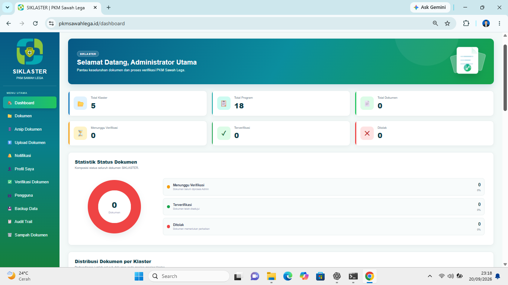
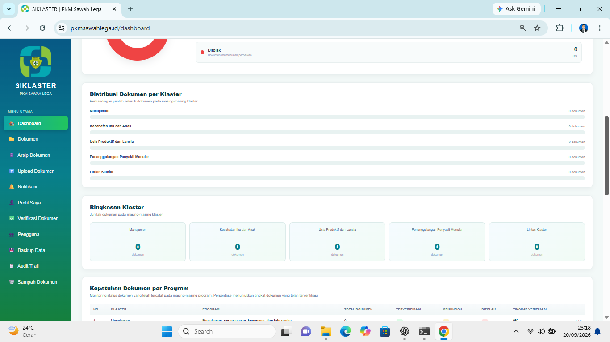
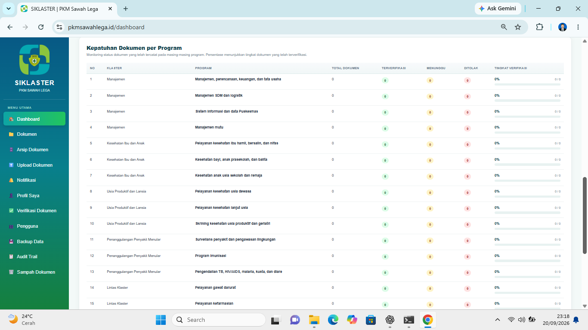
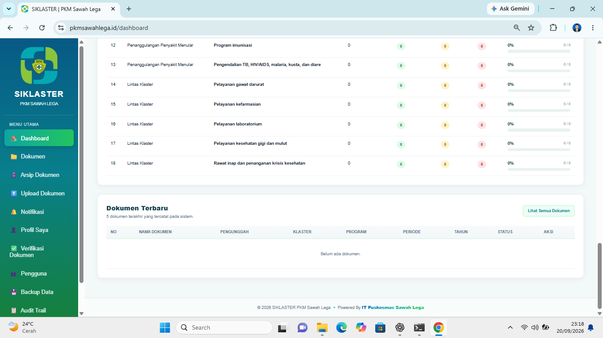
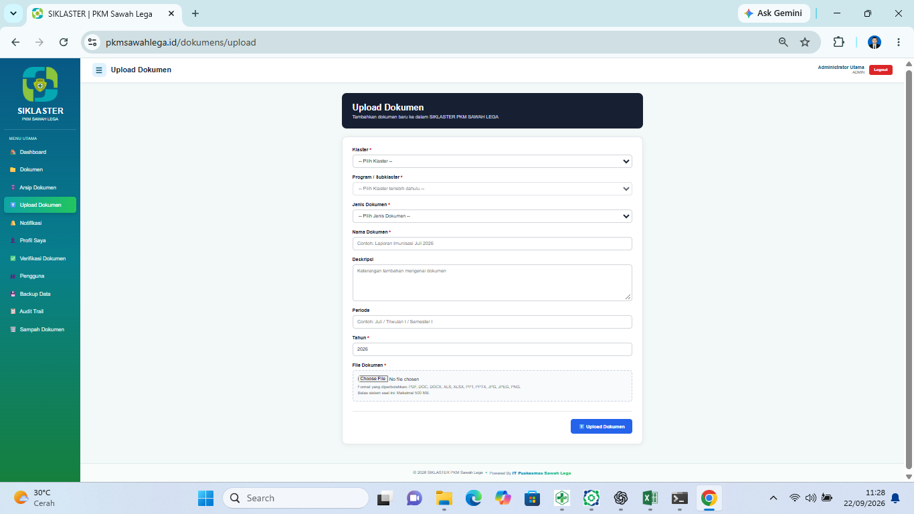
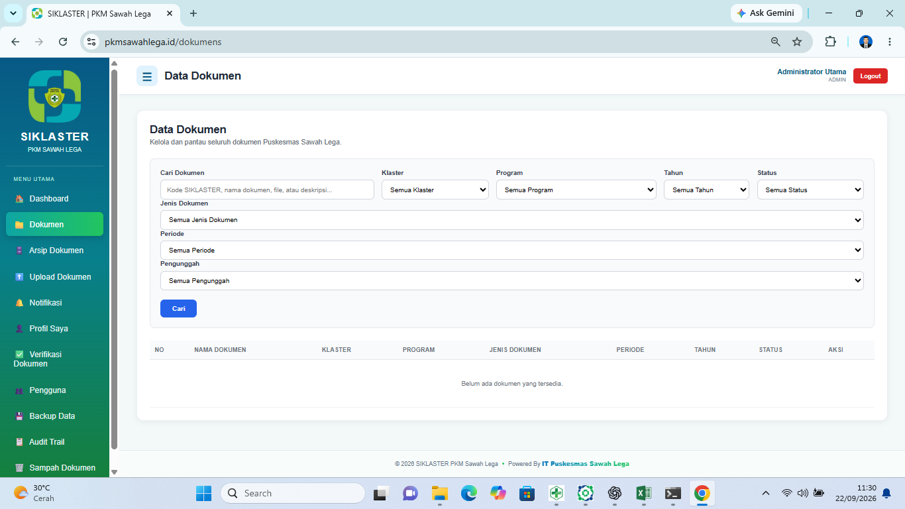
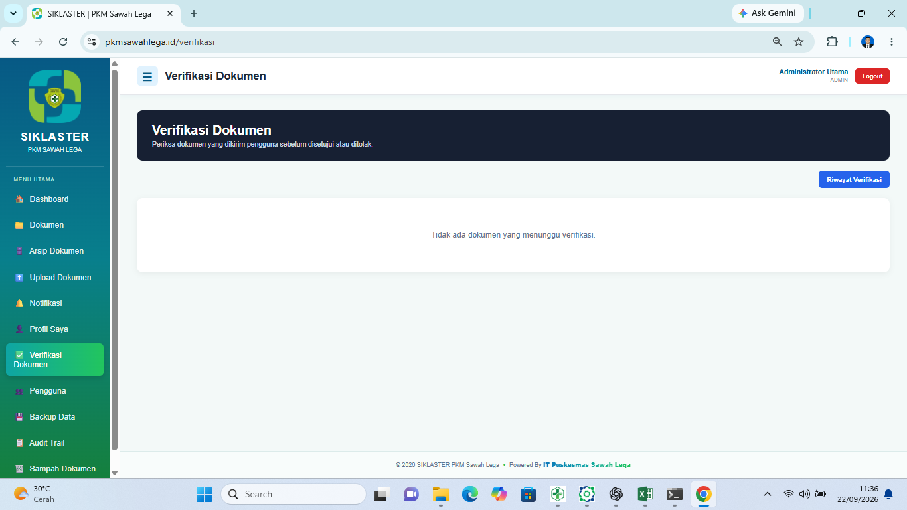
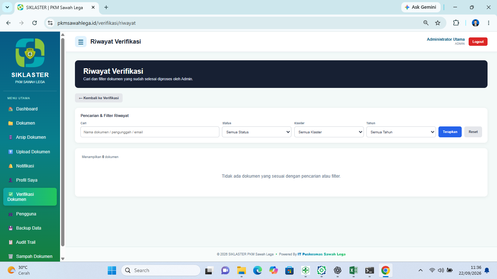
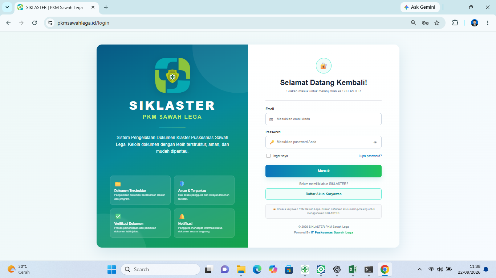

# SIKLASTER

**Sistem Informasi Klaster - Puskesmas Sawah Lega**

SIKLASTER is a web-based document management system developed to help organize, store, search, and verify operational documents across healthcare service clusters at Puskesmas Sawah Lega.

This project was developed using Laravel and MySQL as a practical solution for centralized document management and monitoring.

## Features

- User authentication
- Document upload and storage
- Document search
- Filter documents by cluster, program, and year
- Document verification workflow
- Approve and reject documents
- Rejection reason management
- Document status tracking
- Document download
- Dashboard monitoring
- Role-based access control
- Responsive web interface

## Document Workflow

Documents can move through several verification statuses:

`Draft` -> `Waiting for Verification` -> `Verified / Rejected`

This workflow helps ensure uploaded documents can be reviewed before being considered verified.

## Technology Stack

- Laravel
- PHP
- MySQL
- Blade
- JavaScript
- HTML
- CSS
- Tailwind CSS
- Vite

## Application Structure

SIKLASTER organizes documents based on healthcare service clusters and programs.

The system supports five main clusters:

1. Management
2. Maternal and Child Health
3. Adult and Elderly Health
4. Communicable Disease Control
5. Cross-Cluster Services

Each cluster contains related programs, allowing documents to be categorized and managed systematically.

## Screenshots

### Dashboard Overview



### Dashboard - Cluster Distribution



### Dashboard - Program Monitoring





### Document Upload



### Document Management



### Document Verification



### Verification History



### Login



## Installation

Clone the repository:

```bash
git clone https://github.com/Rafialdhi99/siklaster-document-management.git
```

Enter the project directory:

```bash
cd siklaster-document-management
```

Install PHP dependencies:

```bash
composer install
```

Install frontend dependencies:

```bash
npm install
```

Create the environment configuration:

```bash
copy .env.example .env
```

Generate the application key:

```bash
php artisan key:generate
```

Configure your MySQL database in `.env`, then run:

```bash
php artisan migrate --seed
```

Create the storage link:

```bash
php artisan storage:link
```

Build frontend assets:

```bash
npm run build
```

Run the development server:

```bash
php artisan serve
```

## Security

Sensitive environment configuration and credentials are not included in this repository.

The `.env` file, production credentials, uploaded operational documents, and other private data are excluded from the public repository.

## Project Background

SIKLASTER was created to address a real operational need for structured document management in a healthcare service environment.

The project demonstrates practical implementation of:

- Database design
- CRUD operations
- Authentication and authorization
- File management
- Search and filtering
- Verification workflows
- Dashboard development
- Deployment of a Laravel web application

## Developer

**Rafialdhi Noor Ihsan**

Junior Web Developer  
Laravel • PHP • MySQL

GitHub: @Rafialdhi99

---

This repository is a portfolio version of SIKLASTER. Sensitive operational data and production credentials are not included.